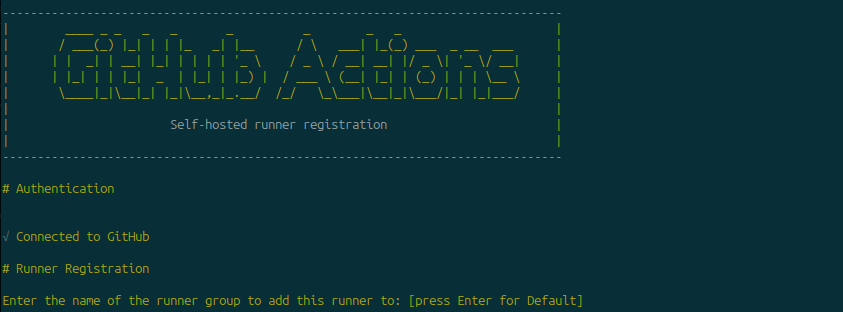
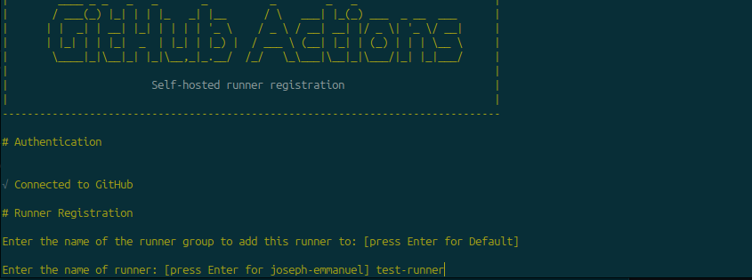
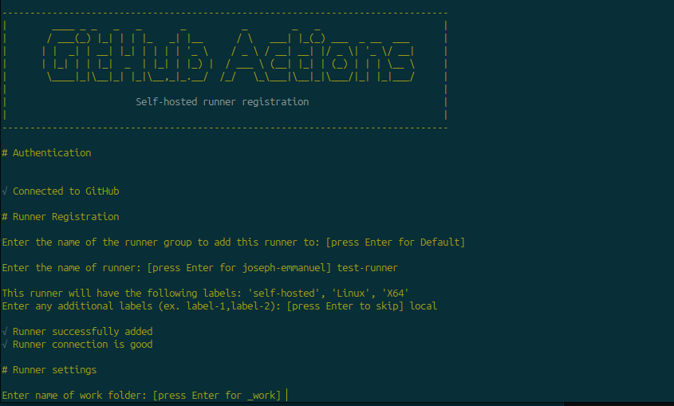
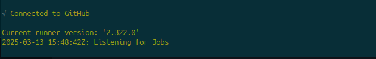

# How to setup Self Hosted GitHub Runner

## Requirements

- A repository with the project to be deployed
- A Linux server, local or hosted on the cloud
- A non-root user account with sudo privilege

## Configuration Steps

- On the project repository, go to settings, select actions on the left menu, then choose Runners
- Click on New self-hosted runner
- Follow the set of instructions on the page, just as seen below
- Select Runner Image, depending on the OS you're running. In this case it's Linux
- Choose the correct Architecture

### Download Installer

- SSH into the server
- Create a folder in the home directory to host the runner setup and configuration files
```console
cd ~
mkdir actions-runner && cd actions-runner
```

- Download the latest runner package. This was the latest version as at when this was written
```console
curl -o actions-runner-linux-x64-2.322.0.tar.gz -L https://github.com/actions/runner/releases/download/v2.322.0/actions-runner-linux-x64-2.322.0.tar.gz
```

- Validate the hash (Optional). This returns OK
```console
$ echo "b13b784808359f31bc79b08a191f5f83757852957dd8fe3dbfcc38202ccf5768  actions-runner-linux-x64-2.322.0.tar.gz" | shasum -a 256 -c
```

- Extract the installer
```console
 tar xzf ./actions-runner-linux-x64-2.322.0.tar.gz
```

### Configure the runner

- Create the runner and start the configuration experience
```console
 ./config.sh --url https://github.com/<github-username>/<repo-name> --token BI5FQPT7KMVFWECPXGDKG23H2MBT4
```
- Be sure to replace the <github-username> and <repo-name> with the actual value. The token will be invalid as at the time you will be reading this.

- If you have an existing runner group, enter the name, or just press enter for default

- Give the runner a name. Choose something appropriate. I used test-runner

- Add a label to the runner, asides the default. I will use local

- Enter name of work folder. This is where it stores records of each job runs. I will go with the default


- Run the GitHub Runner script
```console
./run.sh
```
- It should display on the terminal as seen below if there are no errors.

- If you go back to runners in the repository settings, you should see the runner you just added in the list.

The last script is run on the terminal and will stop if the terminal is closed. To make it run continually in the background, we will configure a system process for it by creating a service file and adding it to the system daemon to monitor

### Run as a system process
- Inside the /actions-runner folder, create a file named runsvc.sh
```console
nano runsvc.sh
```
- Copy the details below into the file. Ensure you change the node version to the proper one.
```ini
#!/bin/bash
 
# convert SIGTERM signal to SIGINT
# for more info on how to propagate SIGTERM to a child process see: http://veithen.github.io/2014/11/16/sigterm-propagation.html
trap 'kill -INT $PID' TERM INT
 
if [ -f ".path" ]; then
    # configure
    export PATH=`cat .path`
    echo ".path=${PATH}"
fi
 
nodever="node20"
 
# insert anything to setup env when running as a service
# run the host process which keep the listener alive
./externals/$nodever/bin/node ./bin/RunnerService.js &
PID=$!
wait $PID
trap - TERM INT
wait $PID
```
- Save and close the file
- Make the file executable
```console
chmod 755 runsvc.sh
```

- Now, we create a service file. You can give it any name. <actions.runner.project.service> is what I used here
- <actions.runner.project.service> will be the name of the service, so use a filename in line with the project or application for ease of use.
```console
sudo nano /etc/systemd/system/actions.runner.project.service
```
- Enter the configuration below into the file
```ini
[Unit]
Description=GitHub Actions Runner
After=network.target
 
[Service]
ExecStart=/home/<username>/actions-runner/runsvc.sh
User=<username>
WorkingDirectory=/home/<username>/actions-runner
Restart=always
RestartSec=3
KillMode=process
KillSignal=SIGTERM
TimeoutStopSec=5min
 
[Install]
WantedBy=multi-user.target
```
- Remember to replace the username, with the signed in user on the server
- Save the file and close
- Reload the system daemon to detect the new file, enable and start the service. <service-name> is the name of the service file
```console
sudo systemctl daemon-reload
```
```console
sudo systemctl enable <service-name>
```
```console
sudo systemctl start <service-name>
```
- Check the status of the service
```console
sudo systemctl status <service-name>
```
- You should see active(running) status.

- Your github runner is successfully setup and will always run in the background.


### Using your self-hosted runner

- To use the runner, add a deploy.yml file to your repo
- Configure it to use the runner you created
```console
runs-on: self-hosted
```
- You can also use the label we added during the setup
```console
runs-on: local
```
- Using labels is ideal for situations where you have more than one runner on the repository and you need a way to distinguish them.
- You can use also use labels when you want to deploy the same application to different servers that have runners on them.
