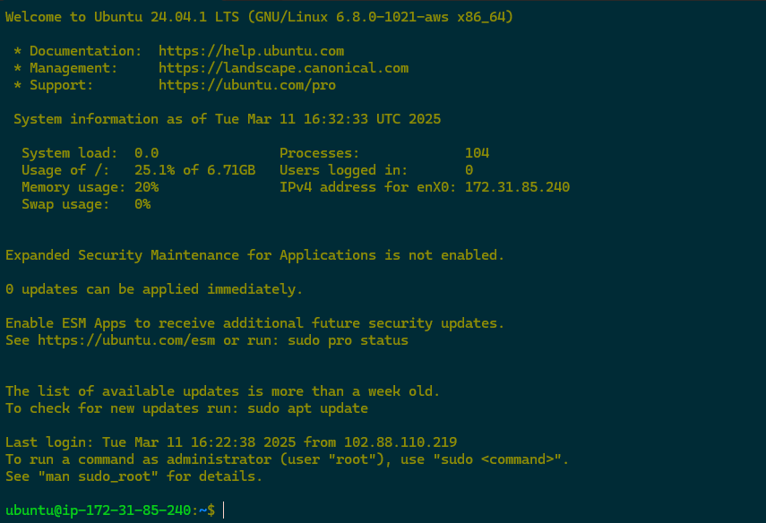

# SSH Remote Server Setup

## Requirements

- A device with OpenSSH installed
- A remote server running Linux

## Server Setup

I used AWS to spin up a virtual server using the steps highlighted below

- Login to console
- Select EC2 under service
- Click Launch Instance
- Give the server a name
- Select Ubuntu Server as OS Image
- Instance type: t3 micro
- Create a new key pair. Give it a name and the file will be downloaded to your machine.
- Accept defaults for the other sections and launch instance

## Create SSH Keys

- This command will create private and public keys and store them in the path provided on your device.
```console
ssh-keygen -t rsa -b 4096 -f ~/.ssh/id_rsa_key1
ssh-keygen -t rsa -b 4096 -f ~/.ssh/id_rsa_key2
```

## Copy the public SSH Keys to the server

- On a Windows machine, you might have to copy the keys manually to the server, because the ssh-copy-id command doesn't work
```sh
ssh-copy-id -i ~/.ssh/id_rsa_key1.pub username@server-ip
ssh-copy-id -i ~/.ssh/id_rsa_key2.pub username@server-ip
```
- To copy the public key manually, connect to the serve from the admin console and copy the content of '~/.ssh/id_rsa_key1.pub' to ~/.ssh/authorized_keys
- Repeat the same step for the second key.

After you verify that the public key is on the server:
- Open the SSH configuration file
```console
sudo nano /etc/ssh/sshd_config
```
- Remove the comment on the following lines
```console
PubkeyAuthentication yes
AuthorizedKeysFile .ssh/authorized_keys
```

- Restart SSH service
```console
sudo systemctl restart ssh 
```

## Connect to the server with SSH keys

- From your terminal run the command below to connect to the server with the private key on your device.
```console
ssh -i <path-to-privatekey> username@server-ip
```
- Replace <path-to-keypair> with the actual path to where the keypair was saved, server username and IP address
- You should see an interface like this that shows a successful connection
- Exit the console and connect with the second private key




## Configure and connect to the server with alias

- Create a file named config inside ~/.ssh folder
- Add the following lines to the config file

```console
Host testserver
HostName server-ip
User user
IdentityFile ~/.ssh/id_rsa
```
- Replace the server with your preferred alias
- Replace <server-ip>, <user>, and the path to the private key file
- You can now connect to the server with
```console
ssh testserver
```
- You should be logged in to the server just like in the previous step

## Install and Configure Fail2ban

- Login to your server through any means discussed above
- Update server and install fail2ban
```console
sudo apt update
sudo apt install fail2ban -y
```
- Check the status of the fail2ban service. It should be active and running
```console
sudo systemctl status fail2ban
```

- Copy the default configuration file to a local file for customization
```console
sudo cp /etc/fail2ban/jail.conf /etc/fail2ban/jail.local
```
- Open the jail.local file for editing
```console
sudo nano /etc/fail2ban/jail.local
```
- In the jail.local file, enable jails for services you want to protect. In this case it's SSH
```ini
[sshd]
enabled = true
port = ssh
logpath = /var/log/auth.log
maxretry = 5
bantime = 1h
findtime = 10m
```
- Apply the changes by restarting the service
```console
sudo systemctl restart fail2ban
```


Project URL: https://roadmap.sh/projects/ssh-remote-server-setup
