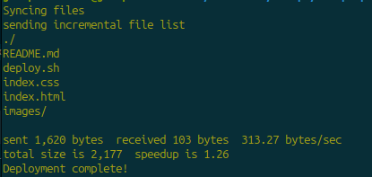

# Static Site Server

This project aims at setting up a remote server, setting up a local website file and then using rsync to deploy them to the remote server.
A deployment script will be used to run the file sync.
An AWS account or any other cloud service provider account is required to complete this project.

## Step 1 - Setup a remote Ubuntu server on AWS

- Log in to AWS console
- Search for EC2 in the services tab
- Click on Launch Instance button to open the configuration pane
- Input a desired name for the server
- Next, choose a suitable linux image to use. I used `Ubuntu 22.04`
- Select Instance type. `t2.micro` is fine
- Create a new key pair, give it a name and select `rsa` and choose the key format, `.ppk` for windows user and `.pem` for linux users, then click create. A copy of the key pair will be downloaded to your device
- In the Security group, select `allow http` from the internet. Then `allow SSH` set it to the default `0.0.0.0/0` or select your ip for better security.
- The remaining details can be left as default.
- Select Launch Instance

## Step 2 - Install and configure Nginx

To install Nginx on the server, you need to login to the server securely.

- On linux, run `chmod 400 /path/to/keypair.pem` to make the file private.
- Copy the public IP address of the server from AWS console and run the command to connect to the server

```console
    ssh -i key.pem username@ip-address
```

Specify the full path to the keypair. The default username for ubuntu image is `ubuntu`

- Update the server and install nginx

```console
    sudo apt update && sudo apt upgrade -y
    sudo apy install nginx
    sudo apt enable nginx
```

- Open a browser and paste the ip address of the server, you should see an Nginx welcome page.
- Create a folder in the `/var/www` folder, it will house the website files

```console
    sudo mkdir /var/www/website
```

- Next we have to setup virtual host on nginx for the website. Run the following commands

```console
    sudo nano /etc/nginx/sites-available/website
```

- Copy and paste the content below inside the file. Replace the `server_ip` with your server IP address and make sure the root points to the folder created earlier

```console
    server {
       listen 80;
       listen [::]:80;

       server_name server_ip;

       root /var/www/website;
       index index.html;

       location / {
               try_files $uri $uri/ =404;
       }
    }
```

- Save and close the file editor
- Link the configuration file to the sites-available directory so Nginx can load the website and restart Nginx

```console
    sudo ln -s /etc/nginx/sites-available/website /etc/nginx/sites-enabled
    sudo nginx -t
    sudo systemctl restart nginx.service
```

## Step 3 - Prepare static files

- Create a project folder on your machine and put your html, css and images in the folder
- Ensure the CSS file is properly referenced inside the html file

## Step 4 - Sync the files with the remote server using rsync

- Create a deployment script with `nano deploy.sh` file and put in the script below

```ini
#!/bin/bash

# Variables
LOCAL_DIR="/path/to/projectfolder"
REMOTE_USER="ubuntu"
REMOTE_HOST="server-ip"
REMOTE_DIR="/var/www/website"
SSH_KEY="/path/to/key.pem"

# Rsync command
echo "==========================="
echo "Syncing files..."
echo "==========================="

rsync -avz -e "ssh -i $SSH_KEY" --delete $LOCAL_DIR/ $REMOTE_USER@$REMOTE_HOST:$REMOTE_DIR

# Change file permission after sync
echo "==========================="
echo "Updating file permissions..."
echo "==========================="
ssh -i "$SSH_KEY" "$REMOTE_USER@$REMOTE_HOST" "sudo chown -R ubuntu:www-data $REMOTE_DIR && sudo chmod -R 755 $REMOTE_DIR"

# Print a message
echo "Deployment complete!"
```

Ensure to use the correct values for the variables

- Make the script executable

```console
    chmod +x deploy.sh or chmod 775 deploy.sh
```

- Run the script to sync the local files to the remote server

```console
    ./deploy.sh
```

- You should see outputs on the terminal similar to the image below
  

Project URL: <https://roadmap.sh/projects/static-site-server>
